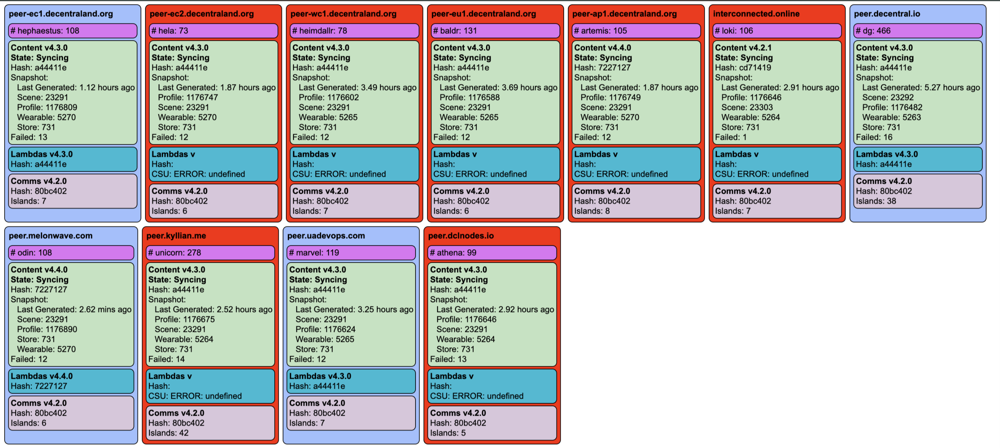
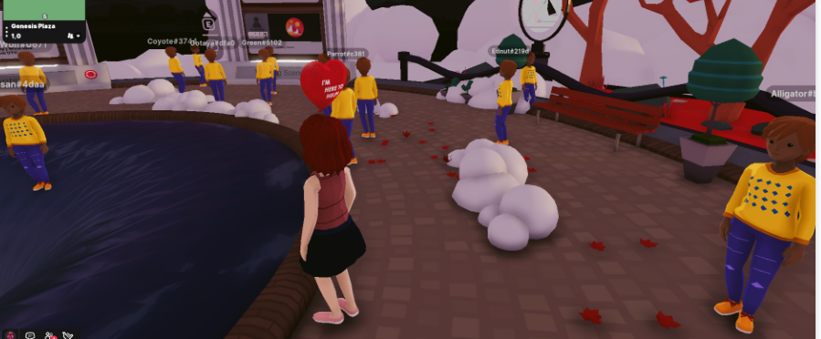
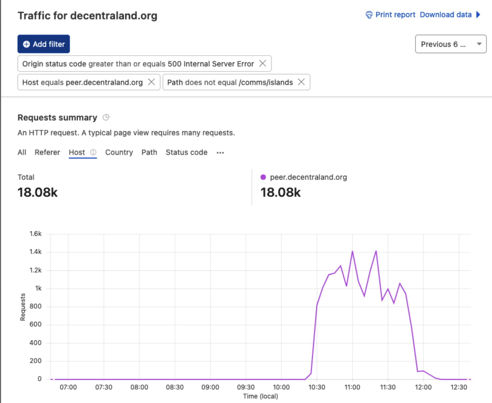
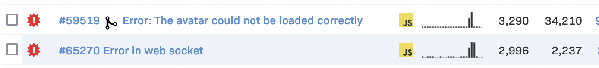

# April 22nd, 2022

|                            |             |
| -------------------------: | :---------- |
| **Reported on**            | Apr-22-2022 |
| **Mitigation**             | Apr-22-2022 |
| **Solution Completed**     | TBD         |
| **Severity**               | SEV-2       |


## What happened?

- Some Catalyst nodes started to report a failing state on the Catalyst Monitor

- Errors on lambdas spike with HTTP 502 Errors and the 
- Market Place was not able to load thumbnail images. 
- Users wearables and profiles were not loading and all people looked the same. 



## Why did it happen?

[Infura](https://infura.io/), the Service that Catalysts use to query the blockchain and do validations, had an outage. Without this service most lambdas were not able to work and the Catalysts nodes could not even be restarted as infura was called during bootstrapping and that error caused a loop in the process. 


## Issue Timeline

- Apr-22-2022 10:30am Infura stops working 
- Apr-22-2022 10:50am The alarms start triggering and the failing nodes are noticed 
- Apr-22-2022 10:53am The endpoint `lambdas/status?includeLayers=true` returns HTTP 502 Bad Gateway error at `peer-ec1.decentraland.org` 
- Apr-22-2022 10:55am `peer-ec1` is restarted to validate if works as a mitigation and doesn't come back up online
- Apr-22-2022 11:01 Logs show errors when calling infura: 
```etchError: invalid json response body at https://mainnet.infura.io/v3/****  reason: Unexpected token < in JSON at position ```
- Apr-22-2022 12:00 New temporal version of [Catalyst Contracts](https://github.com/decentraland/catalyst-contracts) is created using the [CloudFlare Eth Gateway](https://blog.cloudflare.com/cloudflare-ethereum-gateway/)
- Apr-22-2022 12:00 The above dependency version is updated in [Lighthouse](https://github.com/decentraland/lighthouse/blob/main/package.json#L29), [Catalyst](https://github.com/decentraland/catalyst/commit/ccf57c68abcf3ab28807b1501245f9d0f6ff9c94) and [@dcl/catalyst-node-common](https://github.com/decentraland/catalyst-node-commons/commit/e30d271c2347db184bc08e7367a86a669304be37) 
- Apr-22-2022 12:09 Infura starts to respond again and 500 errors spikes down 
   
- Apr-22-2022 12:10 Catalyst node `peer-ec1` starts successfully 
- Apr-22-2022 12:10 The patch is no longer needed but tested in Lower Envs. The proposed mitigation works as expected 
- Apr-22-2022 12:10 Services go back to normal 
- Apr-22-2022 12:10 Task created for the definitive solution described below

## Impact 

- The Marketplace was not able to show the thumbnail images 
- Profile wearables were not loading on the Explorer and 36k errors were triggered, potentially affecting most users connected to Decentraland 


## Solution 

Create a fallback process on the Catalyst Servers so that when Infura doesn't respond, the service can automatically try with Alchemy or CloudFlare Eth Proxy and by doing so, remove this single point of failure. 
