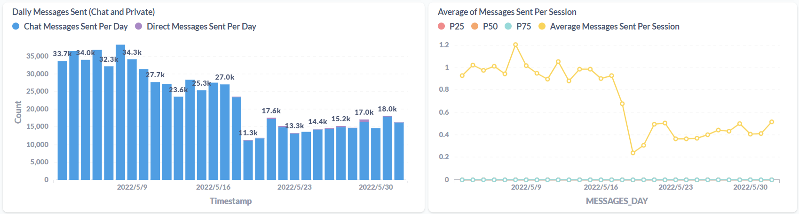
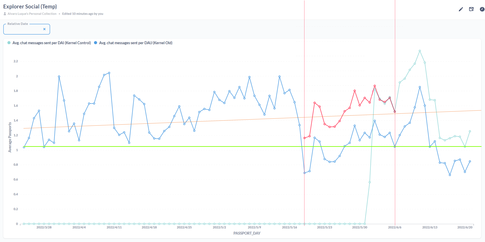

# June 6th, 2022

# Context - Social Metrics Postmortem
2022-06-02
We are in the middle of developing a UI/UX change for chat, voice chat and friends, which will accommodate all private conversations, and future channels, on the left side of the screen, without overtaking the space designated for the SDK. For the moment we have released the first version, which includes the refactoring and redesign of the public conversation (now renamed #nearby), and the private chats. Currently, integrating voice chat and designing the new notification system ([interactive prototype here](https://www.figma.com/proto/SxxomcIZI1zyytMZmFJAvS/Social-Module-%5Bwip%5D?page-id=2396%3A12884&node-id=2463%3A14345&viewport=-1626%2C914%2C0.19&scaling=scale-down&starting-point-node-id=2409%3A12946)).
The improvements can be seen in the [Social HUD](https://www.figma.com/file/SxxomcIZI1zyytMZmFJAvS/Social-Module-%5Bwip%5D?node-id=604%3A13360), [Social Improvements](https://www.notion.so/1P-Social-Improvements-6956800acddc4a88a623060ebc94d0fa) and [Channels](https://www.notion.so/PRD-Channels-1a51033cc6134889a4d863d0bd1cb607) documentation.

At the same time, in order to start making data-driven decisions, several changes have been made to [introduce new metrics](https://www.notion.so/1P-Social-Improvements-6956800acddc4a88a623060ebc94d0fa) and modify some existing ones.

April 13, 2022 - 

- Added Message type to metrics, to differentiate between private or public messages.
- This was requested for the OKRs

May 19, 2022

- Removed social metrics from kernel to Unity in this [Pull Request](https://github.com/decentraland/kernel/pull/296)
- Introduced new metrics in Unity for social in this [Pull Request](https://github.com/decentraland/unity-renderer/pull/1994)
- Messages sent were now split in 2 different metrics, public / private messages (previously being the same one but flagged with the source attribute
- 1st batch of UI/UX changes were introduced to unify social interaction on the left side of the screen and accommodate Channels and Notifications in the next versions, can be seen in [Pull Request](https://github.com/decentraland/unity-renderer/pull/1994).

May 26, 2022 

- [Metrics related to messages](https://metabase.decentraland.systems/dashboard/308-explorer-social?relative_date=past30days) sent in the platform seem to go down to 1/3 of what it has been previous to the release of the 19th of May

# Analysis

Several things changed at the same time during the 19th of May release. Some hypothesis lead to:

- **Metrics were moved from Kernel to Unity.** The messages reported could be different, including or not some like “welcome” toast, commands like `/goto` or whispers. Initial analysis lead to think this not the case. [This report](https://docs.google.com/document/d/1h1Rj9sxTjvn-HQ88xB0gdmkXIUSMUmo5K7Boymv2J0U/edit#) was created to describe the rationale and queries behind [this data](https://docs.google.com/spreadsheets/d/1V2aqgRLTgqM2pdG-hxM18jFNRpfTBY_Xzt5aPfgZtVM/edit#gid=95387942)
- **The metric of messages sent has been split in 2, which diluted the aggregated value.** Initial analysis concludes that the number of private messages represent the 2-3% of the total messages, which implies that the drop could not be that significant. We have solid metrics that can be extracted from the Matrix server to know for sure the number of private messages sent, but it's not possible to do this for comms, and we need to rely on Metabase data.
- **UX/UI changes now pin/unpin the public conversation.** As we are preparing to include channels, we need a new system to receive notifications from multiple conversations at the same time, without focusing the main attention in the nearby chat. This first development batch lacks of the Notification system, and we had to hijack the conversation's panel into a middle solution that fades out when you click in-world, pinning it to the left side. This pins the current conversation, either if it's the private one, or the public channel. But also, players have the possibility to close the conversation, so they only see the counter badge growing on the conversation icon.
This may have caused a deterioration in the usability and muscle memory of users, having to re-acclimate to a new way of operating.

It is difficult to assume a loss of 66% of the use of a functionality just because of UX changes, so we understand that something must have happened that we are not taking into account.

# Action Points

After a meeting with all the team involved, we have decided to take the following decisions to better address the root of the problem, and alleviate the current situation:

- In the next release, we will include [a patch](https://github.com/decentraland/unity-renderer/issues/2384) that forces the public conversation on the left side of the screen, once you stop interacting with the chat panel, so that it is always present.
- We will revert the method that sent the metrics from Kernel, rename its eventID, and compare its data with the ones we now send from Unity. In a few days we will see if there are differences and what messages may be missing.
- We are accelerating the design of the notifications and channels to start their development next week (kickoff with the teams scheduled for Tuesday), and eliminate this intermediate stage that is not good for the current use, nor for the next one

# Follow Up

June 2, 2022 

After the inclusion of the old metrics sent from Kernel, there is a difference between the ones sent by unity:

Kernel: 11.112

Unity: 8.643

[Metabase query to follow up the next days](https://metabase.decentraland.systems/question/1792-temp-messages-sent-kernel-vs-unity)

June 6, 2022 

Metrics conclude that 1/3 of the drop-off in the metrics are related to kernel sending more signals than Unity. Need to find out why.

June 22, 2022 

