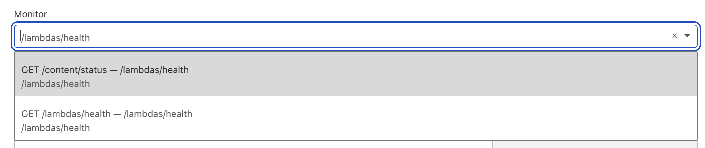
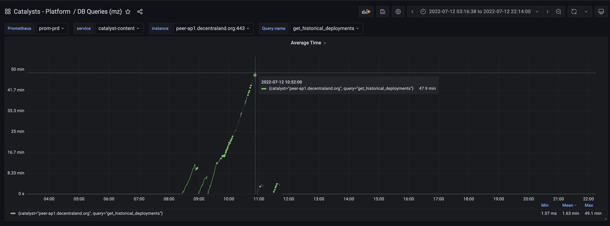
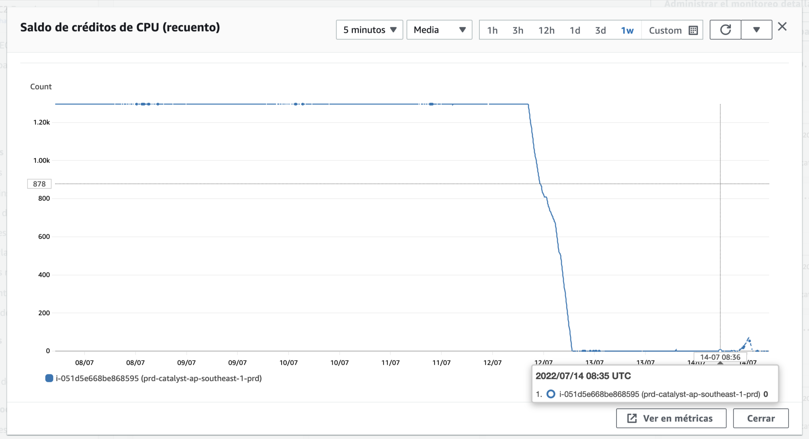

# July 12th, 2022

|                            |             |
| -------------------------: | :---------- |
| **Reported on**            | July-12-2022 |
| **Mitigation**             | July-12-2022 |
| **Solution Completed**     | July-15-2022 |
| **Severity**               | SEV-3        |


## What happened? 

After updating **peer-ec1** and **peer-ap1** from Catalyst `v4.8.0` to `v4.8.4` the nodes started to throw CPU alarms and the Lambdas Service entered in a continuous reboot cycle. 
 
## Why did it happen?

After several tests, it was detected that the change causing this issue was a [refactor](https://github.com/decentraland/catalyst/pull/1168) on the Lambdas routes to prepare the service to use Well Known Components in the future but the rollout converged with a major DB change that led to think the issue was there and this situation added complexity to the troubleshooting process. 

## Issue Timeline 

Several changes were accumulated in the release rollout and those potential sources of the issues added complexity to finding out what was the root cause of the problem.  

July-12-2022 - New Catalyst version [v4.8.4](https://github.com/decentraland/catalyst/releases/tag/4.8.4) created. This version had a major change in the DB schema and all the queries impacted by this.

July-12-2022 - Upgrade nodes **peer-ec1** and **peer-ap1** from `v4.8.0` to `v4.8.4`

July-12-2022 - After a while of the version update, alarms started to be triggered and lambdas services started to reboot

July-12-2022 - To mitigate the issue **peer-ec1** was rolled back to `v4.8.0` and the `maxUsers` of **peer-ap1** was set to ``0`` to avoid users being sent to the node

July-12-2022 - Despite the change in the `maxUsers` property on **peer-ap1**, it was reported that people were still being directed to the node. After reviewing the Load Balancer configuration it was noticed that there were two health checks but the one being used was just a rename of `/content/status` instead of actually calling `/lambdas/health`. This was fixed and no more traffic was redirected to the affected node. 
*CloudFlare Load Balancer*:


July-12-2022 The following patterns were detected: 
First the `get_historical_deployments` query started to take a lot of time, leading to think that the changes on the DB had something to do with this issue 



On the other hand, this was also causing CPU spikes 


An the following HTTP Requests pattern started to appear on the Content Server  


As a result, the AWS instance run out of CPU credits and this didn't allow the node to recover from this situation. 



And the queries started to throw timeout errors on the lambdas logs: 
``` 
Error: Query read timeout
    at Timeout._onTimeout (/app/node_modules/pg/lib/client.js:526:21)
    at listOnTimeout (node:internal/timers:559:17)
    at processTimers (node:internal/timers:502:7)
```

July-13-2022 A [fix](https://github.com/decentraland/catalyst/commit/3f12deb2536bf6dab39ae7bcdfdfcacb1e71f803) for the DB changes was added and tested on **peer-ap1** but the same issue happened. 

July-13-2022 A Catalyst tag version with a rollback of **all the Catalyst DB** changes was created and tested on **peer-ap1**. The HTTP Request pattern still happen. 

July-13-2022 In order to be sure, another tag version was tested started from `v4.8.0` and with the DB changes and everything worked fine. This had the major DB changes and the fix for the `overwrittenBy` value calculation on the DB.

July-13-2022 The remaining biggest change was in Lambdas, this was rollback and all the changes in the middle patches between `v4.8.0` and `v4.8.4` versions were added, creating a new version with all the changes but this refactor. In theory, the removed change shouldn't have affected the performance as it was just a reorganization of the endpoints in preparation to then use Well Known Components on the Service, this change didn't have an actual feature implementation.

July-14-2022 The tag version was tested overnight and everything worked normal. Users were allowed to join **peer-ap1** again.

July-14-2022 Even if the performance was working as expected it was noticed that some Failed Deployments were being accumulated on the node. Mainly reporting the following error: 

```
"errorDescription": "Errors deploying entity(bafkreidxvfln55tb47lqf26dz65obtgizbjrvaoy7t7ysvgx3ozs7yosx4):\n - Couldn't find thumbnail file with hash: bafkreid3hmcbcj4d35itnvw6w2o3dufiwvcznx6szqj4u44di3kpse73ii",
```

After digging in, this was because some entities that were tried to sync didn't have the `"content": []` referenced files. The filed deployments stabilized on 192 and a [new task](https://github.com/decentraland/catalyst/issues/1190) to research this issue was created. This was not related to latest changes and the hypothesis is that an outdated node allowed this deployments after the [ADR-45](https://github.com/decentraland/adr/blob/main/docs/ADR-45-entities-v4.md) was rollout.   

Failed Deployment Example: 
```
[
    {
        "version": "v3",
        "id": "bafkreigq2we7tr3674yloaf5uq32e7yg4myuxw447hu33v777q6xrpzc7q",
        "type": "profile",
        "pointers": [
            "0xf9bfa18b95d5ceff301c5f937e5211fb0787da86"
        ],
        "timestamp": 1652392765226,
        "content": [],
        "metadata": {
            "avatars": [
                {
                    "userId": "0xf9bfa18b95d5ceff301c5f937e5211fb0787da86",
                    "email": "",
                    "name": "iceloops",
                    "hasClaimedName": true,
                    "description": "a guy on the internet",
                    "ethAddress": "0xf9bfa18b95d5ceff301c5f937e5211fb0787da86",
                    "version": 10,
                    "avatar": {
                        "bodyShape": "urn:decentraland:off-chain:base-avatars:BaseMale",
                        "wearables": [
                            "urn:decentraland:off-chain:base-avatars:casual_hair_01",
                            "urn:decentraland:off-chain:base-avatars:eyebrows_01",
                            "urn:decentraland:off-chain:base-avatars:eyes_02",
                            "urn:decentraland:off-chain:base-avatars:f_mouth_02",
                            "urn:decentraland:off-chain:base-avatars:beard",
                            "urn:decentraland:off-chain:base-avatars:oxford_pants",
                            "urn:decentraland:off-chain:base-avatars:classic_shoes",
                            "urn:decentraland:matic:collections-v2:0xae3d6cbe10cb4a0947c5e8362efb2802ab5098ab:0",
                            "urn:decentraland:matic:collections-v2:0xc818a4a1f99ec77a35e6f51aabfc8c517acc9d95:2",
                            "urn:decentraland:matic:collections-v2:0x5c3232279a3b85ba970f48a8408bf8b1379380fb:4"
                        ],
                        "snapshots": {
                            "body": "bafkreibbcgy335g3kz5kol25brbta6bx4wbkr522yeup3k74uu2kvo2qva",
                            "face256": "bafkreiber2htjpoqcocnvupy5mms6ww4cwjxkx6qqgsxx5ekeffwn3nbri"
                        },
                        "eyes": {
                            "color": {
                                "r": 0.37109375,
                                "g": 0.22265625,
                                "b": 0.1953125,
                                "a": 1
                            }
                        },
                        "hair": {
                            "color": {
                                "r": 0.55078125,
                                "g": 0.125,
                                "b": 0.078125,
                                "a": 1
                            }
                        },
                        "skin": {
                            "color": {
                                "r": 0.94921875,
                                "g": 0.76171875,
                                "b": 0.6484375,
                                "a": 1
                            }
                        }
                    },
                    "tutorialStep": 256,
                    "interests": [],
                    "unclaimedName": "iceloops",
                    "hasConnectedWeb3": true
                }
            ]
        }
    }
]
```


July-15-2022 New [hotfix](https://github.com/decentraland/catalyst/releases/tag/4.8.6) version created and updated.

## Impact 

No major impact. The Catalyst **peer-ec1** was quickly rolled back to `v4.8.0` and **peer-ap1** node was left out from the Load Balancer and the Realm scoring logic to avoid traffic being request/sent from/to that node. 

## Solution 

- Lambdas refactor rollback. 
- Fix for the calculation of the overwrittenBy value on the DB
- Analyzing changing the AWS instance Type to be less restricted by the CPU Credits, there are newer, better, cheaper instance types.
- Health check configuration fixed on the Load Balancer.
- Under research but not part of this issue, the set of accumulated Failed Deployments on **peer-ap1** due to the missing thumbnail.
- Rollout all patches version as soon as they are ready.

