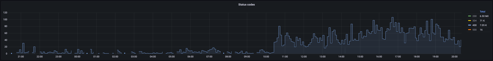
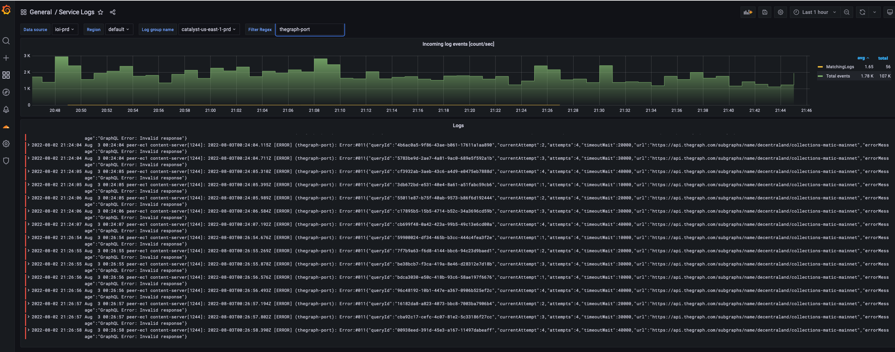

# August 2nd, 2022

|                            |             |
| -------------------------: | :---------- |
| **Reported on**            | Aug-02-2022 |
| **Mitigation**             | N/A         |
| **Solution Completed**     | Aug-02-2022 |
| **Severity**               | SEV-1       |


## What happened? 

Users were not able to change their Avatar wearables preventing them to access experiences like the Casino.  

## Why did it happen?

The Collectins Graph was more than 10 minutes away from the latest block, causing the Profiles update validations to fail as the Catalyst nodes query the las block with a 5 minutes time window. 


## Issue Timeline 

July-12-2022 20:10 Users at the Decentraland Games scene reported that they couldn't change their wearables and the catalyst endpoint was failing 
```
POST /content/entities responds 400 with the error {"errors":["The following items () are not owned by the address 0x8f20c5acaf44ec084cb1936d116601d99d2e8704)."]}
```
Error rates started to spike 


The Graph errors shown in the Content Server


After Checking the [collection logs](https://thegraph.com/hosted-service/subgraph/decentraland/collections-matic-mainnet?selected=logs) and compared with the latest mined block on [polygonscan](https://polygonscan.com/) you could see a 9 to 10 minutes difference. 

July-12-2022 20:29 Error reported to The Graph. The failing query was 

```
query getNftItemsForBlock($block: Int!, $ethAddress: String!, $urnList: [String!]) {
  items: nfts(
    block: {number: $block}
    where: {owner: $ethAddress, searchItemType_in: ["wearable_v1", "wearable_v2", "smart_wearable_v1", "emote_v1"] urn_in: $urnList}
    first: 1000
  ) {
    urn
  }
}
```
Example: 
```
{
  items: nfts(
    block: { number: 31447174 }
    where: {owner: "0x8f20c5acaf44ec084cb1936d116601d99d2e8704", searchItemType_in: ["wearable_v1", "wearable_v2", "smart_wearable_v1", "emote_v1"]
    urn_in: ["urn:decentraland:matic:collections-v2:0x7e553ede9b6ad437262d28d4fe9ab77e63089b8a:3", "urn:decentraland:matic:collections-v2:0x84a1d84f183fa0fd9b6b9cb1ed0ff1b7f5409ebb:10"]
    }
    first: 1000
  ) {
    urn
  }
}
```
July-12-2022 21:44 The team confirmed that the graph was behind ~250 blocks and scale the infra to speed up the indexing
July-12-2022 23:00 The Graph node catch up with blockchain and issue was resolved  

## Impact 

Most users on the platform were not able to update their profile. This prevented users to enjoy some of the experiences that requires you to wear some NFTs. 


## Solution 

- New Alert with spikes on the The Graph Error rates 
- Working on having Foundation own The Graph node and implementing a fallback 