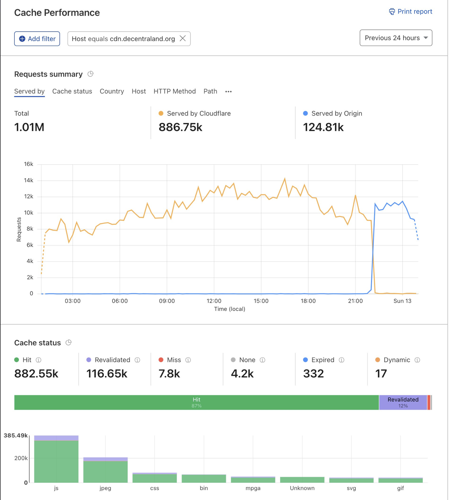
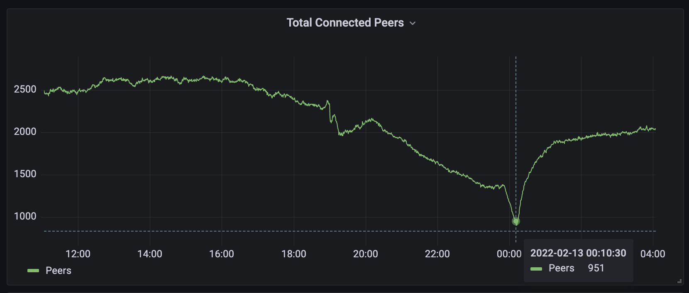

# February 12th, 2022

|                        |             |
| ---------------------: | :---------- |
| **Reported on**        | Feb-12-2022 |
| **Mitigation**         | Feb-13-2022 |
| **Solution Completed** | Feb-16-2022 |

## What happened?

Users connected to Decentraland started to drop continuously and when trying to connect to the world, users received a UI error saying that the file 
https://cdn.decentraland.org/@dcl/kernel/1.0.0-1814221959.commit-9d3539b/index.js could not be downloaded. 
This issue happened the night before of the Super Bowl-Millerbar Event, where we were expecting a connected users spike. 

## Why did it happen?

CloudFlare CDN stopped working, seemed that due to some configuration on their side the responses stopped before the transfer of the file ended. It is possible that this configuration on CloudFlare was related with a request that we did to them in order to support partial fetch for content download.


## Issue Timeline

- Feb-12-2022 Around midnight users started to report the issue on Discord and users count started to dropped.
- Feb-12-2022 Issue was easily reproducible and was affecting every user that re-login or try to connect to Decentraland
- Feb-12-2022 No changes were made to the Kernel repository on the last 4 days before the incident 
- Feb-12-2022 Manually trying to download the file https://cdn.decentraland.org/@dcl/kernel/1.0.0-1814221959.commit-9d3539b/index.js never finished loading. 
- Feb-12-2022 The CloudFlare failing file was pointing to the following CloudFront file which could be downloaded directly from CloudFront https://d3qp42no1quna9.cloudfront.net/@dcl/kernel/1.0.0-1814221959.commit-9d3539b/index.js
- Feb-12-2022 Similar error appear with a different file from the explorer website
- Feb-12-2022 CloudFlare Dashboard showed how the `cdn.cloudflare.org` cache started to be served by origin 
  
- Feb-13-2022 Grafana Dashboard showed how the connected peers were dropping due to this issue. The following snapshot was taken after the incident was fixed. 

- Feb-13-2022 Deployed new version of the Kernel but didn't help. The intention was to redeploy the file that was causing the issue 
- Feb-13-2022 Disabled the CloudFlare proxy on the host `cdn.decentraland.org` 
- Feb-13-2022 Issue reported to CloudFlare
- Feb-13-2022 Response from the CloudFlare team 
``` 
I see you have currently disabled Cloudflare proxy on the host cdn.decentraland.org for the time being.
 Therefore if I manually redirect a test request to the Cloudflare IP for your zone as per follows:
curl -svo /dev/null https://cdn.decentraland.org/@dcl/kernel/1.0.0-1814221959.commit-9d3539b/index.js --connect-to ::104.19.216.110
 We can extract the following from the output:
Cache-Control: public, max-age=365000000
CF-Cache-Status: REVALIDATED
I believe there may be an issue with the max-age as per 365000000 equals 11yrs, and there online standardized articles suggesting the highest the protocol accepts is 31536000 (1yr)
https://developers.google.com/web/fundamentals/performance/get-started/httpcaching-6
https://ashton.codes/set-cache-control-max-age-1-year/
If you would like to align and let us know.
```
- Feb-13-2022 Changed the settings according to CloudFlare feedback https://github.com/decentraland/cdn-uploader/commit/8a0f83176eb28d7f8b69c60bc5aeadc7a89040a6
- Feb-13-2022 We were still able to reproduce the issue with files with the correct max age and using the CDN proxy
`curl -sv https://cdn.decentraland.org/@dcl/kernel/1.0.0-1837492817.commit-a39eb15/index.js --connect-to ::104.19.216.110 -o /dev/null` 
- Feb-13-2022 Other sites like  https://events.decentraland.org/ were affected by this issue
- Feb-13-2022 Escalated issue on CloudFlare 
- Feb-13-2022 Marked affected sites as Under Maintenance and let the community know about the generalized issue 
- Feb-13-2022 Turn off most of the CloudFlare proxies 
- Feb-13-2022 Sites working with a higher cost due to the direct downloads from CloudFront 
- Feb-14-2022 CloudFlare support: 
```
This issue looks to be connected to how Cloudflare is requesting ranges for files at your origin.
We are investigating further but in the meantime we have increased the size from 1MB ranges to 5MB ranges which has fixed the issue on the relevant files, if this is causing problems for other (larger files) we can disable this entirely.
Please let us know if you would prefer this?
```
- Feb-16-2022 CloudFlare proxies were reactivated for testing. Seemed that they fixed the issue on their side and anything went back to normal. 

## Impact 

- ~ 1k5 users disconnected from Decentraland during a period of ~ 8Hs
- 400 USD x days of CloudFront, cost around 1k2 USD

## Solution 

A temporary solution was to disable the CloudFlare CDN proxies until they addressed the issue on their side and we could reactivate the Service.
