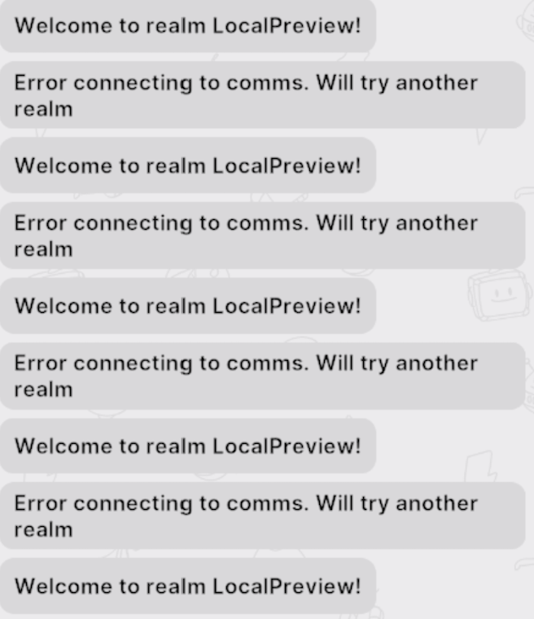

# March 28th, 2023 - User connections constantly reconnected to the same realm

|                          |               |
| -----------------------: | :------------ |
| **Reported on Slack**    | March-28-2023 |
|           **Mitigation** | March-29-2023 |
|   **Solution Completed** | April-5-2023  |

## What happened?

Several users were experiencing frequent disconnections and reconnections to the same realm, resulting in their avatars repeatedly spawning at the main scene points.

## Why did it happen?

The steps to reproduce the issue were not straightforward and deterministic, and it appears that the root cause may be connected to some significant refactoring that was done on the client to enhance its performance. One of these changes may have caused the client to mishandle certain existing communication events, resulting in the mentioned problem.

## Issue Timeline 

1. 2023-03-28 The following issue was reported by a couple of users:  
2. 2023-03-28 First hypothesis tested and quickly discarded: heimdallr node was blocked by a Feature Flag and a user inside the realm trying to access a different Genesis City location using the Explore Map ended up in a realm loop. 
3. 2023-03-28 Second hypothesis: an island change could be triggering a realm change, the realm selection algorithm chooses the same most eligible realm causing the user to teleport to the same realm and position, making the user appear at the scene spawning point. 
4. 2023-03-29 Created a [client hotfix](https://github.com/decentraland/unity-renderer/pull/4793) with a bump of the LiveKit lib to version [1.7.1](https://github.com/livekit/client-sdk-js/releases) which includes some connections management fixes that could help with the existing problem. 
5. 2023-03-29 Started tracking LiveKit disconnection causes from the client to better assess what could be happening with the communication channel.  
6. 2023-03-29 Contacted LiveKit Cloud team to confirm if there were any issues on their end. Everything looked normal and they requested LiveKit session IDs to further investigate on the cluster logs, as these IDs were not part of the existing metrics [they were added](https://github.com/decentraland/unity-renderer/commit/78a826538894c5a4a8242af6e736af685c10140b) for future reference. On the other hand, this made the LiveKit team notice that there was no information on the LiveKit SDK to manage the Data Channels congestions and added this for the next release (already available at [v1.8.0](https://github.com/livekit/client-sdk-js/releases/tag/v1.8.0))
7. 2023-03-29 The profile update messages were being set as reliable instead of lossy ([more info](https://docs.livekit.io/client/data-messages/)), which could result in a high volume of potential message overload, leading to congestion and potential communications issues. A new [client hotfix](https://github.com/decentraland/unity-renderer/pull/4801) was created with this enhancement. 
8. 2023-03-29 The client began to accumulate disconnection causes events. Upon analyzing the causes some enhancements were made to better manage client messages when the connection is unavailable. Preventing these event errors with better connection management could help avoid the reconnection triggering.  
9. 2023-03-29 At some point of the reconnection process the client stopped in a debugger endpoint when no realm was defined. The realms list shouldn't be empty. This could be caused by a previous [realm selection improvement](https://github.com/decentraland/kernel/commit/d22f1d32ba426412271bf60ee55f01b5af88ec05) that was filtering the nodes candidates to avoid reconnecting to a realm that didn't have a Communication service running. 
10. 2023-03-29 A [client hotfix](https://github.com/decentraland/unity-renderer/pull/4797) was created to throw a fatal error if the realms list was empty. 
11. 2023-03-29 A way to reproduce the console log exceptions thrown during the reconnection was to open two client sessions at the same time. This created a reconnection loop between the two sessions instead of kicking out the old session. This could also be contributing to the problem with users having more than one live session. 
12. 2023-03-29 New [client hotfix](https://github.com/decentraland/unity-renderer/pull/4804) created to bring down a client on a duplicated id. 
13. 2023-04-04 Another [client hotfix](https://github.com/decentraland/unity-renderer/pull/4853) with the connection management improvement was pushed to production and, as a result, the unexpected disconnections events were significantly reduced 
14. 2023-04-04 The issue was reproduced also in the LocalPreview, leaving LiveKit or the comms external infra out of the equation  
15. 2023-04-04 With the connection management improvements the reconnection errors started to be less frequent 
16. 2023-04-04 A [refactor](https://github.com/decentraland/unity-renderer/pull/4873) was made to improve the voice chat sagas to better understand the code and see if something was failing there.
17. 2023-04-05 Created another [fix](https://github.com/decentraland/unity-renderer/pull/4891) to kill the second session running as the previous one was not fully killing the existing session    

## Impact

During the time of the incidents some users were being reconnected to the same realm at the scene spawning point, in some cases preventing them to successfully participate in some events or creating a very bad user experience. 

## Solution

New metrics were added to track disconnection errors and several hot fixes were applied to the client to improve the communication management and avoid several errors that could lead to a reconnection. With each fix added the error started to be less frequent and harder to reproduce, as of today, no more reports of this issue were received. 

Hot fix list: 
 - [Hotfix 1](https://github.com/decentraland/unity-renderer/pull/4793): LiveKit lib bump to 1.7.1
 - [Hotfix 2](https://github.com/decentraland/unity-renderer/pull/4801): Make profile messages lossy 
 - [Hotfix 3](https://github.com/decentraland/unity-renderer/pull/4797): Throw fatal error if there is no Catalyst node available 
 - [Hotfix 4](https://github.com/decentraland/unity-renderer/pull/4804): Bring down client on duplicated id  
 - [Hotfix 5](https://github.com/decentraland/unity-renderer/pull/4853): Connection management improvement 
 - [Hotfix 6](https://github.com/decentraland/unity-renderer/pull/4891): Graceful disconnect on duplicated session 

