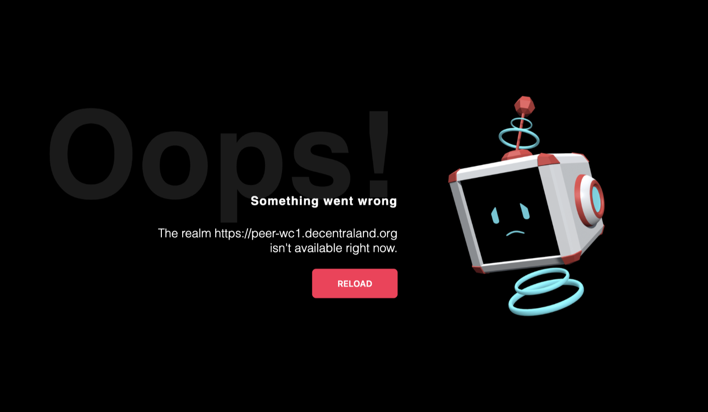

# April 13th, 2023 - Users are not visible in any realm other than HEIMDALLR

|                          |               |
| -----------------------: | :------------ |
| **Reported on Slack**    | April-13-2023 |
|           **Mitigation** | April-13-2023 |
|   **Solution Completed** | April-13-2023 |

## What happened?

Users encountered an error message and were unable to establish a connection to Decentraland through `https://play.decentraland.org/`.

## Why did it happen?

The changes implemented in the [realm-picking algorithm](https://github.com/decentraland/unity-renderer/pull/4852) had repercussions on how users were able to connect to the platform. This was due to updates made to the `acceptingUsers` property, which now filters out realms with CPU/RAM usage exceeding 90% or those that have reached the maximum user threshold (_MAX_USERS_). This property is tightly coupled with various workflows related to realm selection. At the time of the issue, the realm-picking algorithm accurately determined the most appropriate realm for each user. However, the connection could not be established because the selected realm was filtered out after the selection process as it was full.

## Issue Timeline - UTC

1. 2023-04-12 15:20 Inadvertently, [an explorer-bff version was mis-released](https://github.com/decentraland/explorer-bff/actions/runs/4679549013/jobs/8289713469?pr=250) and published in the docker images registry as `latest`. This occurred due to a misconfiguration in the CI/CD pipeline, which made the pipeline to trigger from a pull request (PR).
2. 2023-04-13 09:36 The following issue was reported by many users: 
3. 2023-04-13 11:33 First hypothesis analyzed and discarded: comms was failing leading to users not able to connect between them and see each other.
4. 2023-04-13 12:15 Discovered that certain nodes were utilizing the [mis-released explorer-bff version](https://quay.io/repository/decentraland/explorer-bff/manifest/sha256:85761f6410ec30d38cc49e0064df0ef94e2fa95834f3965a5b14ae0d13b37eff), which had been erroneously published as the `latest` version.
5. 2023-04-13 12:24 The mis-released version of the explorer-bff service was corrected by publishing the stable version on the `latest` tag, effectively replacing the erroneous release. Although this action contributed to a reduction in errors associated with user visibility, it did not completely eliminate them.
6. 2023-04-13 13:58 Discovered that `heimdallr` realm was returning `acceptingUsers=false` due to being at full capacity. Furthermore, the recent enhancements made to the realm-picking algorithm were filtering out this realm after it had been selected, resulting in connection issues. At the time, the `ALL_PEERS_SCORE` realm-algorithm rule was in effect, redirecting users to the most crowded realm, which happened to be `heimdallr`. As a result, the realm-picking algorithm selected `heimdallr` as the appropriate realm for users. However, when attempting to establish a connection, the client refused due to the realm being full.
7. 2023-04-13 18:21 [Released a hot-fix on client-side](https://github.com/decentraland/unity-renderer/pull/4955) to implement a pre-filtering mechanism for full nodes before initiating the realm selection process.

## Impact

Throughout the duration of the incidents, users were only able to connect to Decentraland by specifying a realm that was not at full capacity. This meant that they were unable to access the platform through `https://play.decentraland.org/`.

## Solution

A pre-filter mechanism was added to `unity-renderer` to avoid selecting full realms while executing the realm-picking algorithm.

- [x](https://github.com/decentraland/unity-renderer/pull/4955)